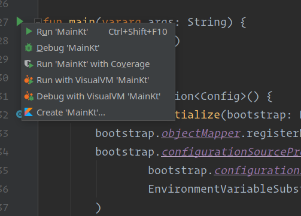
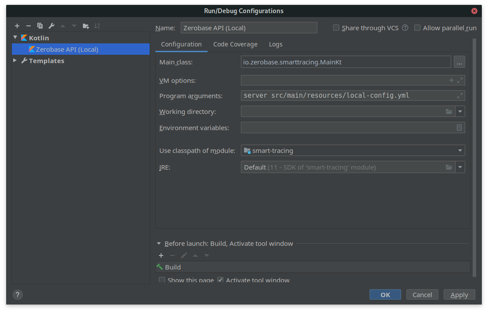

# Zerobase API Server

This repository contains the back end for the Zerobase smart tracing platform. Refer to the [smart-tracing repo](https://github.com/zerobase-io/smart-tracing) for the front end. We are using Kotlin and Neo4j with cloud storage on Heroku. We are using Dropwizard for the REST framework. Kotlin requires Java and Maven. 

## Set up for the project

### Kotlin
The backend is written in Kotlin. While you can work on it in any editor, such as vim or VS Code, it is significantly easier to use an IDE. We recommend [IntelliJ](https://www.jetbrains.com/idea/download/index.html).

### Java 11

This project targets the current LTS version of Java: 11. You are welcome to use any of the JDK implementations locally, but deployments
will be done using an AdoptOpenJDK build. If you want to use Oracle's official JDK, it can be dowloaded [here](https://www.oracle.com/java/technologies/javase-jdk11-downloads.html).
We recommend, however, that you install the JDK using a package manager, such as `brew` on macOS, to easily stay up to date. 

### Maven
Maven is a dependency management and build tool that is commonly used in the Java world. It is available for installation via package
managers, such as `brew` on macOS, for easy updating (recommended way) but can also be installed manually. 

#### Install manually
* Download Maven from [here](https://maven.apache.org/download.cgi)
* Follow these installation instructions [here](https://maven.apache.org/install.html)
* Add the full path to your ~/.bash_profile, ~/.zshrc, or similar.


### Docker
Docker is used to run Neo4j while running the project locally.  

* Install docker manually by following this [guide](https://www.docker.com/get-started) or via a package manager.
* Pull the Neo4j image
    ```sh
    $ docker pull neo4j
    ```
* Run the Neo4j image 
    ```sh
    $ docker run -d -p7474:7474 -p7687:7687 --name=zerboase-db neo4j:latest
    ```
* Open http://localhost:7474/ in your browser to access the Neo4j console
  The default credentials for neo4j are: 
  * username: neo4j
  * password: neo4j
  
  You will then be asked to set a new password, which is what the app will use to connect.

#### Install Neo4j without Docker
If you're unable to use Docker to install Neo4j, there is an alternative available. The desktop version of Neo4j can be downloaded from [here](https://neo4j.com/download/). After downloading, the web page will have a token for you; *you need this token, so don't close the window*. Start the application and provide the token when prompted.

Once the application is running, click the "Create Graph" button in the bottom right and create a new graph, the name of which is 
irrelevant. You will be prompted to create a password, you will need to remember this for further steps. You can then use the browser 
button in the top right to open the Neo4j browser.

## Project
After cloning the project there are two ways to deploy it locally: using an IDE or via the command line. By default, the app listens on 
port 9000. You can override that with an environment variable of `PORT` if you need to.

### Running in an IDE
The following directions use Intellij as the IDE, but the steps should be similar if you are using a different IDE. 

* If necessary, navigate to File/Project Structure. Update the SDK for the project to JDK11.
* Open `Main.kt`
* In `Main.kt`, click on the run button next to main and select Edit Run Configuration



* Set the environment variable:
`GRAPHENEDB_PASSWORD=<your_password_for_neo4j>`
* Set the program arguments as `server src/main/resources/config.yml`



* Click `OK` and run the configuration you just made.

### Running from the command line.
* From the project's root directory, build the project. 
    ```sh
    $ mvn clean install
    ```
* Set the `GRAPHENEDB_BOLT_PASSWORD` environment variable, either as an export or inline, and run the jar.
    * Export
        ```sh
        $ export GRAPHENEDB_BOLT_PASSWORD=<your neo4j password>
        $ java -jar target/smart-tracing-api.jar server target/classes/config.yml
        ```
    * Inline
    ```sh
    $ GRAPHENEDB_BOLT_PASSWORD=<your neo4j password> java -jar target/smart-tracing-api.jar server target/classes/config.yml
    ```
  ### Debugging / Calling end points 
  * Once you're running the project, you can double check if all is well by going to ``` localhost:8081 ``` for the admin interface (if ```0.0.0.0:8081``` isn't working for you)
